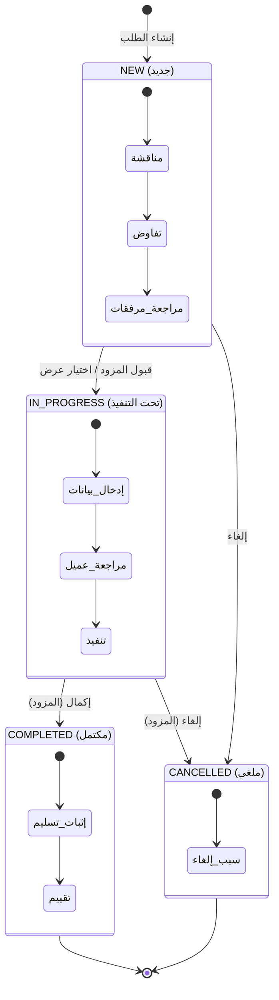

# 🔎 تقرير التحليل العميق — نظام الطلبات في منصة نوافذ

> **تاريخ الإنشاء:** 2026-02-28  
> **النطاق:** تحليل معماري + منطقي + تشغيلي شامل لنظام الطلبات  
> **الملفات المحللة:** 25+ ملف عبر 10 تطبيقات Django

---

## 📑 فهرس المحتويات

1. [نظرة عامة معمارية](#1-نظرة-عامة-معمارية)
2. [نموذج الكيانات (Entity Model)](#2-نموذج-الكيانات)
3. [مخطط علاقات الكيانات (ERD)](#3-مخطط-علاقات-الكيانات)
4. [آلة الحالة (State Machine)](#4-آلة-الحالة)
5. [مخطط تدفق الطلبات](#5-مخطط-تدفق-الطلبات)
6. [تحليل أنواع الطلبات الثلاثة](#6-تحليل-أنواع-الطلبات)
7. [مصفوفة الصلاحيات (RBAC)](#7-مصفوفة-الصلاحيات)
8. [تحليل الفجوات](#8-تحليل-الفجوات)
9. [حالات السباق (Race Conditions)](#9-حالات-السباق)
10. [سيناريوهات الفشل](#10-سيناريوهات-الفشل)
11. [تحسينات معمارية](#11-تحسينات-معمارية)
12. [هيكل قاعدة البيانات المقترح](#12-هيكل-قاعدة-البيانات-المقترح)
13. [تحسينات RBAC](#13-تحسينات-rbac)
14. [تحسينات Monetization](#14-تحسينات-monetization)
15. [التوصيات التقنية](#15-التوصيات-التقنية)

---

## 1. نظرة عامة معمارية

### 1.1 البنية العامة

```
┌─────────────────────────────────────────────────────────┐
│                    Flutter Mobile App                     │
│            (Client View + Provider View)                  │
└─────────────┬───────────────────────────┬───────────────┘
              │  REST API (DRF)           │
┌─────────────▼───────────────────────────▼───────────────┐
│                   Django Backend                         │
│  ┌──────────┐ ┌──────────────┐ ┌──────────────────┐    │
│  │ accounts │ │  marketplace │ │ unified_requests │    │
│  │ (Auth)   │ │  (الطلبات)   │ │ (لوحة موحدة)     │    │
│  └──────────┘ └──────┬───────┘ └──────────────────┘    │
│  ┌──────────┐ ┌──────▼───────┐ ┌──────────────────┐    │
│  │providers │ │  messaging   │ │  notifications   │    │
│  │(المزودين)│ │  (المحادثات) │ │  (الإشعارات)     │    │
│  └──────────┘ └──────────────┘ └──────────────────┘    │
│  ┌──────────┐ ┌──────────────┐ ┌──────────────────┐    │
│  │ reviews  │ │   billing    │ │  subscriptions   │    │
│  │(التقييم) │ │ (الفواتير)   │ │  (الاشتراكات)    │    │
│  └──────────┘ └──────────────┘ └──────────────────┘    │
│  ┌──────────┐ ┌──────────────┐ ┌──────────────────┐    │
│  │ features │ │    promo     │ │  verification    │    │
│  │(التأطير) │ │ (الإعلانات)  │ │  (التوثيق)       │    │
│  └──────────┘ └──────────────┘ └──────────────────┘    │
└─────────────────────────────────────────────────────────┘
              │
┌─────────────▼───────────────────────────────────────────┐
│                  SQLite (dev) / PostgreSQL (prod)         │
└─────────────────────────────────────────────────────────┘
```

### 1.2 التطبيقات الأساسية وعلاقتها بنظام الطلبات

| التطبيق | الدور في نظام الطلبات | الإعتمادية |
|---------|----------------------|------------|
| `marketplace` | **المحرك الرئيسي** — إنشاء/إدارة/تتبع الطلبات | مستقل |
| `accounts` | الهوية والأدوار (العميل/المزود/الموظف) | مستقل |
| `providers` | ملفات مقدمي الخدمة والتصنيفات | يعتمد على `accounts` |
| `messaging` | المحادثات المرتبطة بالطلبات + المباشرة | يعتمد على `marketplace` |
| `notifications` | الإشعارات التفاعلية (طلب جديد/عرض/حالة) | يعتمد على `marketplace` |
| `reviews` | التقييم بعد الإنجاز (5 معايير) | يعتمد على `marketplace`+`providers` |
| `billing` | الفواتير والدفع | مستقل (ربط عام) |
| `subscriptions` | الباقات (أساسية/ريادية/احترافية) | يعتمد على `billing` |
| `unified_requests` | لوحة متابعة موحدة لجميع أنواع الطلبات | لا يتتبع طلبات السوق حالياً |
| `features` | بوابة المميزات حسب الباقة | يعتمد على `subscriptions` |

---

## 2. نموذج الكيانات

### 2.1 الكيانات الرئيسية

```
┌─────────────────────────────────────────────────────────────────────┐
│                        نموذج الكيانات الأساسي                       │
├─────────────────────────────────────────────────────────────────────┤
│                                                                     │
│  User (المستخدم)                                                    │
│  ├── phone, email, first_name, last_name                           │
│  ├── role_state: visitor→phone_only→client→provider→staff           │
│  ├── Wallet (1:1)                                                  │
│  ├── ProviderProfile (1:1, اختياري)                                 │
│  │   ├── display_name, bio, city, lat/lng                          │
│  │   ├── provider_type: individual/company                          │
│  │   ├── accepts_urgent, coverage_radius_km                         │
│  │   ├── rating_avg, rating_count                                  │
│  │   ├── is_verified_blue, is_verified_green                        │
│  │   ├── ProviderCategory (M2M → SubCategory)                      │
│  │   ├── ProviderService (1:N)                                     │
│  │   ├── ProviderPortfolioItem (1:N)                               │
│  │   └── ProviderSpotlightItem (1:N)                               │
│  └── Subscription (1:N)                                            │
│      └── SubscriptionPlan (N:1)                                    │
│                                                                     │
│  ServiceRequest (طلب الخدمة)                                       │
│  ├── client (FK→User)                                              │
│  ├── provider (FK→ProviderProfile, nullable)                       │
│  ├── subcategory (FK→SubCategory)                                  │
│  ├── title (50 حرف), description (500 حرف)                         │
│  ├── request_type: normal/competitive/urgent                        │
│  ├── status: new/in_progress/completed/cancelled                    │
│  ├── city, is_urgent, expires_at                                   │
│  ├── quote_deadline (للتنافسي)                                      │
│  ├── expected_delivery_at, estimated_service_amount                 │
│  ├── received_amount, remaining_amount                              │
│  ├── delivered_at, actual_service_amount                            │
│  ├── canceled_at, cancel_reason                                    │
│  ├── provider_inputs_approved (bool, null)                          │
│  ├── ServiceRequestAttachment (1:N)                                │
│  ├── RequestStatusLog (1:N, سجل تدقيق)                             │
│  ├── Offer (1:N, للطلبات التنافسية)                                 │
│  ├── Thread (1:1, محادثة)                                          │
│  └── Review (1:1, تقييم)                                           │
│                                                                     │
│  Offer (العرض — للطلبات التنافسية)                                  │
│  ├── request (FK→ServiceRequest)                                   │
│  ├── provider (FK→ProviderProfile)                                 │
│  ├── price, duration_days, note                                    │
│  └── status: pending/selected/rejected                             │
│                                                                     │
│  Review (التقييم)                                                   │
│  ├── request (1:1→ServiceRequest)                                  │
│  ├── provider (FK→ProviderProfile)                                 │
│  ├── client (FK→User)                                              │
│  ├── rating (1-5, محسوب من المعايير)                                │
│  ├── response_speed, cost_value, quality, credibility, on_time      │
│  ├── comment, provider_reply                                       │
│  └── moderation_status: approved/rejected/hidden                   │
│                                                                     │
│  Thread (المحادثة)                                                  │
│  ├── request (1:1→ServiceRequest, اختياري)                          │
│  ├── participant_1/2 (للمحادثات المباشرة)                           │
│  ├── is_direct, context_mode                                       │
│  ├── Message (1:N)                                                 │
│  │   ├── body, attachment, attachment_type                          │
│  │   └── MessageRead (1:N)                                         │
│  └── ThreadUserState (per-user settings)                           │
│                                                                     │
│  Invoice (الفاتورة)                                                │
│  ├── user, subtotal, vat_amount, total                             │
│  ├── reference_type, reference_id (ربط عام)                        │
│  ├── InvoiceLineItem (1:N)                                         │
│  └── PaymentAttempt (1:N)                                          │
│                                                                     │
│  Notification (الإشعار)                                             │
│  ├── user, title, body, kind, url                                  │
│  ├── audience_mode: client/provider/shared                          │
│  └── is_read, is_pinned, is_follow_up, is_urgent                   │
│                                                                     │
└─────────────────────────────────────────────────────────────────────┘
```

---

## 3. مخطط علاقات الكيانات (ERD)

```
                          ┌──────────────────┐
                          │    Category       │
                          │  id, name         │
                          └────────┬─────────┘
                                   │ 1:N
                          ┌────────▼─────────┐
                          │   SubCategory     │
                          │  id, name         │
                          └───┬────────┬──────┘
                              │        │
              ┌───────────────┘        └────────────────┐
              │ N:M                                     │ FK
    ┌─────────▼──────────┐                    ┌─────────▼──────────┐
    │  ProviderCategory  │                    │  ServiceRequest    │
    │  provider, subcat  │                    │  (طلب الخدمة)      │
    └─────────┬──────────┘                    │                    │
              │ FK                            │ client → User      │
    ┌─────────▼──────────┐          FK ◄──────┤ provider → Profile │
    │  ProviderProfile   │──────────────────► │ subcategory        │
    │  (ملف المزود)      │                    │ type: N/C/U        │
    │                    │                    │ status: N/IP/C/X   │
    │  user → User (1:1) │                    └───┬───┬───┬───┬────┘
    │  rating_avg/count  │                        │   │   │   │
    │  city, lat/lng     │                        │   │   │   │
    │  accepts_urgent    │                 1:N    │   │1:1│   │1:1
    └────────────────────┘                ┌───────┘   │   │   │
                                          │  ┌────────┘   │   │
    ┌──────────────────┐          ┌───────▼──▼──┐   ┌─────▼───┐
    │      User        │          │    Offer    │   │ Review  │
    │  phone, role     │          │  price, dur │   │ 5 axes  │
    │  first/last name │          │  status     │   │ rating  │
    │                  │◄─────────┤  provider   │   │ comment │
    │  Wallet (1:1)    │          └─────────────┘   └─────────┘
    │  Subscriptions   │                  │1:1
    │  Notifications   │          ┌───────▼─────┐
    └──────────────────┘          │   Thread    │
              │                   │  messages[] │
              │                   │  is_direct  │
              │ FK                └──────┬──────┘
    ┌─────────▼──────────┐               │1:N
    │   Subscription     │        ┌──────▼──────┐
    │  plan, status      │        │   Message   │
    │  invoice (FK)      │        │  body, file │
    └──────────┬─────────┘        │  reads[]    │
               │ FK               └─────────────┘
    ┌──────────▼─────────┐
    │   Invoice          │
    │  code, total, VAT  │
    │  reference_type/id │
    │  PaymentAttempt[]  │
    └────────────────────┘

    ┌──────────────────────┐      ┌──────────────────────────┐
    │ RequestStatusLog     │      │ ServiceRequestAttachment │
    │ from/to status       │      │ file, file_type          │
    │ actor, note          │      │ (image/video/audio/doc)  │
    └──────────────────────┘      └──────────────────────────┘
```

---

## 4. آلة الحالة (State Machine)

### 4.1 آلة حالة الطلب الرسمية (ServiceRequest)

```
                    ┌─────────────────────────────────────┐
                    │         إنشاء الطلب (العميل)         │
                    └──────────────┬──────────────────────┘
                                   │
                                   ▼
                    ┌──────────────────────────────┐
                    │          NEW (جديد)           │
                    │                              │
                    │  • مناقشة وتفاوض             │
                    │  • مراجعة مرفقات             │
                    │  • تعديل العنوان/التفاصيل    │
                    │  • إرسال/استقبال عروض (CMP)  │
                    │  • لا التزام مالي            │
                    └──────┬─────────┬─────────────┘
                           │         │
              ┌────────────┘         └──────────┐
              │ قبول المزود                      │ إلغاء المزود
              │ أو اختيار عرض(CMP)               │
              ▼                                  ▼
┌──────────────────────────┐     ┌──────────────────────┐
│   IN_PROGRESS (تحت       │     │  CANCELLED (ملغي)    │
│   التنفيذ)               │     │                      │
│                          │     │  • سبب الإلغاء       │
│  المزود يدخل:            │     │  • تاريخ الإلغاء     │
│  • موعد التسليم المتوقع  │     │  • إشعار للطرف الآخر │
│  • قيمة الخدمة المقدرة   │     │                      │
│  • المبلغ المستلم        │     │  ⛔ حالة نهائية      │
│  • المتبقي              │     └──────────────────────┘
│                          │                ▲
│  العميل يستطيع:         │                │
│  • مراجعة البيانات       ├────────────────┘
│  • إرسال تنبيه          │  إلغاء أثناء التنفيذ
│                          │  (المزود فقط)
└──────────┬───────────────┘
           │
           │ إكمال (المزود)
           ▼
┌──────────────────────────┐
│   COMPLETED (مكتمل)      │
│                          │
│  المزود يدخل:            │
│  • موعد التسليم الفعلي   │
│  • القيمة الفعلية        │
│  • مرفقات إثبات          │
│                          │
│  العميل:                 │
│  • تعليق                 │
│  • تقييم (5 معايير)      │
│                          │
│  ⛔ حالة نهائية          │
└──────────────────────────┘
```

### 4.2 مصفوفة الانتقالات الممكنة

| من \ إلى | NEW | IN_PROGRESS | COMPLETED | CANCELLED |
|-----------|-----|-------------|-----------|-----------|
| **NEW** | — | ✅ قبول/بدء | ❌ | ✅ إلغاء |
| **IN_PROGRESS** | ❌ | — | ✅ إكمال | ✅ إلغاء |
| **COMPLETED** | ❌ | ❌ | — | ❌ |
| **CANCELLED** | ❌ | ❌ | ❌ | — |

### 4.3 آلة حالة العرض (Offer)

```
  ┌─────────┐    اختيار العميل    ┌──────────┐
  │ PENDING │───────────────────►│ SELECTED │
  │(بانتظار)│                    │ (مختار)  │
  └────┬────┘                    └──────────┘
       │ رفض تلقائي
       │ (عند اختيار عرض آخر)
       ▼
  ┌──────────┐
  │ REJECTED │
  │ (مرفوض)  │
  └──────────┘
```

### 4.4 آلة حالة الاشتراك

```
  ┌─────────────────┐    دفع ناجح    ┌────────┐
  │ PENDING_PAYMENT │──────────────►│ ACTIVE │
  │ (بانتظار الدفع) │               │ (نشط)  │
  └─────────────────┘               └───┬────┘
                                        │ انتهاء
                                        ▼
                                   ┌─────────┐    انتهاء    ┌──────────┐
                                   │  GRACE  │────────────►│ EXPIRED  │
                                   │ (سماح)  │             │ (منتهي)  │
                                   └─────────┘             └──────────┘
```

---

## 5. مخطط تدفق الطلبات

### 5.1 طلب عروض (تنافسي — Competitive/RFP)

```
 العميل                          النظام                      مقدمو الخدمة
   │                               │                              │
   │  1. إنشاء طلب تنافسي          │                              │
   │  (عنوان + تفاصيل + تصنيف     │                              │
   │   + مرفقات + موعد عروض)       │                              │
   ├──────────────────────────────►│                              │
   │                               │  2. حفظ الطلب (NEW)          │
   │                               │  3. إشعار تلقائي لجميع      │
   │                               │     المطابقين (تصنيف+مدينة)  │
   │                               ├─────────────────────────────►│
   │                               │                              │
   │                               │  4. عرض في القائمة          │
   │                               │     المتاحة (competitive)    │
   │                               │                              │
   │                               │  5. مقدم خدمة يرسل عرض     │
   │                               │◄─────────────────────────────┤
   │                               │  (سعر + مدة + ملاحظة)       │
   │  6. إشعار: وصل عرض جديد      │                              │
   │◄──────────────────────────────┤                              │
   │                               │                              │
   │  7. مراجعة العروض             │                              │
   │  8. اختيار أفضل عرض          │                              │
   ├──────────────────────────────►│                              │
   │                               │  9. إسناد للمزود المختار     │
   │                               │     (رفض باقي العروض)        │
   │                               │  10. إشعار: تم اختيار عرضك  │
   │                               ├─────────────────────────────►│
   │                               │                              │
   │                               │  11. المزود يقبل ويبدأ       │
   │                               │◄─────────────────────────────┤
   │                               │  Status → IN_PROGRESS        │
   │                               │                              │
   │                               │  12. المزود يكمل             │
   │                               │◄─────────────────────────────┤
   │                               │  Status → COMPLETED          │
   │                               │                              │
   │  13. تقييم الخدمة             │                              │
   ├──────────────────────────────►│                              │
   │  (5 معايير + تعليق)          │                              │
```

### 5.2 خدمة عاجلة (Urgent)

```
 العميل                          النظام                      مقدمو الخدمة
   │                               │                              │
   │  1. إنشاء طلب عاجل            │                              │
   │  (تصنيف + نوع الخدمة          │                              │
   │   + مرفقات + صوتية)           │                              │
   ├──────────────────────────────►│                              │
   │                               │  2. حفظ (NEW)                │
   │                               │  3. تعيين expires_at         │
   │                               │     (15 دقيقة افتراضياً)     │
   │                               │  4. إشعار عاجل لجميع        │
   │                               │     المطابقين (تصنيف+مدينة  │
   │                               │     + accepts_urgent=True)   │
   │                               ├─────────────────────────────►│
   │                               │                              │
   │                               │  5. أول مزود يقبل           │
   │                               │◄─────────────────────────────┤
   │                               │  (select_for_update لمنع     │
   │                               │   المنافسة)                  │
   │                               │                              │
   │                               │  6. Status → IN_PROGRESS     │
   │                               │     provider = المزود        │
   │  7. إشعار: تم قبول طلبك      │                              │
   │◄──────────────────────────────┤                              │
   │                               │                              │
   │  8. محادثة مباشرة             │                              │
   │◄─────────────────────────────►│◄────────────────────────────►│
   │                               │                              │
   │                               │  9. انتهاء الصلاحية         │
   │                               │     (إذا لم يقبل أحد)       │
   │                               │     Status → CANCELLED       │
```

### 5.3 طلب مباشر (Normal/Direct)

```
 العميل                          النظام                      مقدم خدمة محدد
   │                               │                              │
   │  1. زيارة صفحة المزود         │                              │
   │  2. إنشاء طلب مباشر          │                              │
   │  (provider=X, تصنيف,          │                              │
   │   عنوان, تفاصيل, مرفقات)      │                              │
   ├──────────────────────────────►│                              │
   │                               │  3. حفظ (NEW)                │
   │                               │     provider = X             │
   │                               │  4. إشعار للمزود المحدد     │
   │                               ├─────────────────────────────►│
   │                               │                              │
   │                               │  5. المزود يقبل             │
   │                               │◄─────────────────────────────┤
   │                               │  Status → IN_PROGRESS        │
   │                               │                              │
   │  6. محادثة ومناقشة            │                              │
   │◄─────────────────────────────►│◄────────────────────────────►│
   │                               │                              │
   │                               │  7. بدء التنفيذ              │
   │                               │◄─────────────────────────────┤
   │                               │  (موعد + قيمة + مستلم)       │
   │                               │                              │
   │                               │  8. إكمال                    │
   │                               │◄─────────────────────────────┤
   │                               │  (تسليم فعلي + قيمة فعلية)   │
   │                               │  Status → COMPLETED          │
   │                               │                              │
   │  9. تقييم                     │                              │
   ├──────────────────────────────►│                              │
```

---

## 6. تحليل أنواع الطلبات

### 6.1 مقارنة تفصيلية

| الخاصية | طلب عروض (RFP) | خدمة عاجلة | طلب مباشر |
|---------|---------------|-----------|----------|
| `request_type` | `competitive` | `urgent` | `normal` |
| اختيار مزود | ❌ (يُسند عبر العروض) | ❌ (أول مُقبِل) | ✅ (مزود محدد) |
| `provider` عند الإنشاء | `null` | `null` | مزود محدد |
| المنافسة | ✅ عروض متعددة | ✅ سباق القبول | ❌ تعاقد مباشر |
| `expires_at` | ❌ | ✅ (15 دقيقة) | ❌ |
| `quote_deadline` | ✅ | ❌ | ❌ |
| المرفقات | ✅ | ✅ | ✅ |
| رسالة صوتية | ✅ (audio field) | ✅ (audio field) | ✅ (audio field) |
| الإشعار عند الإنشاء | عبر الاشتراك | فوري لجميع المطابقين | فوري للمزود المحدد |
| آلية الإرسال | حسب الباقة* | فوري | فوري |

> \* **ملاحظة:** آلية التأخير حسب الباقة (فوري/24ساعة/72ساعة) **غير مُطبقة حالياً في الكود**. الإرسال فوري لجميع الباقات.

### 6.2 Validation Rules (من الكود الفعلي)

```python
# ServiceRequestCreateSerializer.validate():
if request_type in ("competitive", "urgent") and provider is not None:
    raise "هذا النوع من الطلبات لا يدعم تحديد مزود خدمة"

if request_type == "normal" and provider is None:
    raise "طلب عادي يتطلب تحديد مزود خدمة"

# المدينة مطلوبة إلا للعاجل مع dispatch_mode=all
if not city and not (request_type == "urgent" and dispatch_mode == "all"):
    raise "المدينة مطلوبة"
```

---

## 7. مصفوفة الصلاحيات (RBAC)

### 7.1 نظام الأدوار الحالي

```
visitor (0) → phone_only (1) → client (2) → provider (3) → staff (4)
     ↑ OTP        ↑ تسجيل       ↑ تسجيل       ↑ إنشاء ملف   ↑ Admin
                  إرسال          كامل          مزود
```

### 7.2 مصفوفة الإجراءات

| الإجراء | العميل | المزود (غير مُسند) | المزود (مُسند) | الموظف |
|---------|--------|-------------------|---------------|--------|
| إنشاء طلب | ✅ | ❌ | ❌ | ❌ |
| تعديل عنوان/تفاصيل (NEW فقط) | ✅ | ❌ | ❌ | ❌ |
| عرض طلباتي | ✅ | — | ✅ | ✅ |
| قبول طلب مُسند | ❌ | ❌ | ✅ | ✅ |
| رفض طلب مُسند | ❌ | ❌ | ✅ | ❌ |
| قبول طلب عاجل | ❌ | ✅ (مطابق) | — | ❌ |
| إرسال عرض (تنافسي) | ❌ | ✅ (مطابق) | — | ❌ |
| اختيار عرض | ✅ | ❌ | ❌ | ❌ |
| بدء التنفيذ | ❌ | ❌ | ✅ | ✅ |
| تحديث مدخلات التنفيذ | ❌ | ❌ | ✅ | ❌ |
| إكمال | ❌ | ❌ | ✅ | ✅ |
| إلغاء | ❌* | ❌ | ✅ | ✅ |
| تقييم | ✅ | ❌ | ❌ | ❌ |
| الرد على تقييم | ❌ | ❌ | ✅ | ❌ |
| إرسال رسالة | ✅ | ❌ | ✅ | ❌ |

> \* **ملاحظة:** `RequestCancelView` يرفض طلبات العميل حالياً (`"إلغاء الطلب متاح للمزوّد فقط"`). لكن `execute_action("cancel")` في `services/actions.py` يسمح للعميل بالإلغاء. **هناك تناقض بين واجهة API وطبقة الخدمات.**

---

## 8. تحليل الفجوات

### 8.1 فجوات منطقية حرجة 🔴

| # | الفجوة | التفاصيل | الأثر |
|---|--------|---------|-------|
| G-01 | **آلية التأخير حسب الباقة غير مُطبقة** | المتطلب ينص على: فوري (احترافية)، 24 ساعة (ريادية)، 72 ساعة (أساسية). الكود يُرسل فوري للجميع. | مقدمو الخدمة بالباقة الأساسية يرون الطلبات بنفس سرعة الاحترافية |
| G-02 | **تناقض إلغاء العميل** | `RequestCancelView` يرفض العميل، لكن `execute_action` يسمح. لا يوجد طريق API للعميل لإلغاء طلبه. | العميل لا يستطيع إلغاء طلبه عبر API (رغم أن المنطق يسمح) |
| G-03 | **إعادة فتح الطلب معطّلة** | `RequestReopenView` يُرجع `403` دائماً. | لا يمكن إعادة فتح طلب ملغي |
| G-04 | **اعتماد/رفض مدخلات المزود معطّل** | `ProviderInputsDecisionView` يُرجع `403` دائماً. `provider_inputs_approved` حقل موجود لكن لا يُستخدم فعلياً. | العميل لا يستطيع اعتماد أو رفض بيانات التنفيذ |
| G-05 | **عدم ربط طلبات السوق بـ unified_requests** | `unified_requests` يتتبع (helpdesk/promo/verification/subscription/extras/reviews) فقط. `ServiceRequest` غير مُربط. | لوحة التحكم الموحدة لا تعرض طلبات الخدمة الأساسية |
| G-06 | **حالات شبحيّة في الكود** | الكود يتعامل مع حالات `"sent"`, `"accepted"`, `"expired"` لكنها ليست في `RequestStatus` choices. | تعقيد غير مبرر وحالات لن تحصل |

### 8.2 فجوات متوسطة 🟡

| # | الفجوة | التفاصيل |
|---|--------|---------|
| G-07 | **لا يوجد تتبع للتسليمات الجزئية** | طلب واحد = تسليم واحد. لا يدعم مراحل أو deliverables متعددة |
| G-08 | **لا يوجد نظام نزاعات (Dispute)** | إذا اختلف العميل والمزود لا توجد آلية وساطة |
| G-09 | **لا يوجد escrow/ضمان مالي** | المبالغ المدخلة استرشادية فقط، لا يوجد حجز أو تحصيل فعلي |
| G-10 | **لا يوجد rate limit على إنشاء الطلبات** | عميل قد يُغرق النظام بطلبات |
| G-11 | **نظام الإشعارات لا يدعم FCM Push فعلياً** | `DeviceToken` موجود لكن لا يوجد كود إرسال push |
| G-12 | **لا يوجد SLA أو تنبيه تأخر** | لا يوجد cron/celery task لمراقبة المواعيد وإرسال تنبيهات |
| G-13 | **المحادثة لا تتكامل مع التسجيل الصوتي** | حقل `audio` في المرفقات الأولية فقط، لا في المحادثة المستمرة |
| G-14 | **عدم وجود اختيار أكثر من تصنيف فرعي** | الطلب مرتبط بـ `subcategory` واحد فقط، بينما المتطلب يذكر "اختيار أكثر من مجال تخصص" |

### 8.3 فجوات تحسينية 🟢

| # | الفجوة | التفاصيل |
|---|--------|---------|
| G-15 | **لا يوجد نظام SLA Metrics** | لا يتم قياس وقت الاستجابة أو وقت الإنجاز تلقائياً |
| G-16 | **لا يوجد تقييم تلقائي للمزود** | لا يتم حساب نقاط أداء Provider Score تلقائيًا |
| G-17 | **لا يوجد نظام توصيات** | لا يوجد algorithmic matching بين الطلب والمزودين (فقط التصنيف) |
| G-18 | **لا يوجد CSV/PDF export للطلبات** | ليس هناك API لتصدير البيانات |

---

## 9. حالات السباق (Race Conditions)

### 9.1 حالات مُعالَجة ✅

| الحالة | الآلية |
|--------|--------|
| قبول طلب عاجل من مزودين متعددين | `select_for_update()` في `UrgentRequestAcceptView` |
| اختيار عرض مع تعديل متزامن | `select_for_update()` في `AcceptOfferView` |
| بدء/إكمال/إلغاء متزامن | `select_for_update()` في جميع views الأساسية |

### 9.2 حالات غير مُعالَجة ⚠️

| الحالة | الخطر | التوصية |
|--------|-------|---------|
| **RC-01:** مزود يُرسل عرض بينما العميل يختار عرض آخر | العرض الجديد يُحفظ لطلب تم إسناده | إضافة `select_for_update` على `ServiceRequest` داخل `CreateOfferView` |
| **RC-02:** انتهاء صلاحية الطلب العاجل أثناء القبول | `_expire_urgent_requests()` يُنفَّذ sync في كل request. إذا تأخر thread آخر... | نقل انتهاء الصلاحية إلى Celery Beat task |
| **RC-03:** عميل يعدل الطلب أثناء قبول المزود | لا يوجد قفل مشترك بين `MyClientRequestDetailView.update()` و `ProviderAssignedRequestAcceptView` | إضافة `select_for_update` في view التعديل |
| **RC-04:** تحديث تقييم المزود عند حذف/إنشاء مراجعات متزامنة | `post_save` signal يعمل بدون قفل | استخدام `F()` expressions أو `select_for_update` على ProviderProfile |

---

## 10. سيناريوهات الفشل

### 10.1 سيناريوهات مُعالَجة

| السيناريو | المعالجة |
|-----------|---------|
| طلب عاجل منتهي الصلاحية | `_expire_urgent_requests()` يلغيه |
| عرض مكرر من نفس المزود | `unique_together (request, provider)` + `get_or_create` |
| تقييم مكرر | `OneToOneField` على ServiceRequest |
| محاولة إكمال طلب غير في IN_PROGRESS | Validation في model + API |

### 10.2 سيناريوهات غير مُعالَجة

| السيناريو | الأثر | التوصية |
|-----------|-------|---------|
| **F-01:** المزود لا يستجيب أبداً | الطلب يبقى NEW إلى الأبد | إضافة TTL + auto-cancel/escalation |
| **F-02:** المزود يبدأ ولا يُكمل | الطلب يبقى IN_PROGRESS بلا حد | إضافة deadline enforcement + تنبيهات |
| **F-03:** فشل الإشعار | لا retry ولا dead-letter | إضافة queue + retry mechanism |
| **F-04:** فشل حفظ المرفقات | الطلب يُنشأ بدون مرفقات (لا rollback) | لف المرفقات بـ `transaction.atomic` |
| **F-05:** المزود يحذف حسابه أثناء طلب نشط | `SET_NULL` على provider → طلب بلا مزود في IN_PROGRESS | إضافة pre-delete check |
| **F-06:** العميل يُحظر أثناء طلب نشط | لا معالجة للطلبات المعلقة | إضافة cascading cancel |
| **F-07:** `_expire_urgent_requests()` بطيء مع كميات كبيرة | يُنفَّذ sync في كل request لـ ListView | نقل إلى background task |

---

## 11. تحسينات معمارية

### 11.1 State Machine رسمي

```python
# اقتراح: استخدام django-fsm أو بناء محرك حالة مخصص
from django_fsm import FSMField, transition

class ServiceRequest(models.Model):
    status = FSMField(default=RequestStatus.NEW)

    @transition(field=status, source=RequestStatus.NEW,
                target=RequestStatus.IN_PROGRESS,
                permission='marketplace.can_accept_request')
    def accept(self, provider):
        self.provider = provider

    @transition(field=status, source=RequestStatus.IN_PROGRESS,
                target=RequestStatus.COMPLETED,
                permission='marketplace.can_complete_request')
    def complete(self):
        pass

    @transition(field=status,
                source=[RequestStatus.NEW, RequestStatus.IN_PROGRESS],
                target=RequestStatus.CANCELLED,
                permission='marketplace.can_cancel_request')
    def cancel(self, reason=""):
        self.cancel_reason = reason
        self.canceled_at = timezone.now()
```

### 11.2 نظام توزيع حسب الباقة (Tiered Dispatch)

```python
# اقتراح: Celery tasks للتوزيع المؤجل
from celery import shared_task
from datetime import timedelta

DISPATCH_DELAYS = {
    'professional': timedelta(minutes=0),   # فوري
    'leading': timedelta(hours=24),          # بعد 24 ساعة
    'basic': timedelta(hours=72),            # بعد 72 ساعة
}

@shared_task
def dispatch_competitive_request(request_id, tier):
    """يُرسل إشعارات لمقدمي الخدمة حسب مستوى باقتهم."""
    delay = DISPATCH_DELAYS.get(tier, timedelta(hours=72))
    # إرسال الإشعار بعد التأخير المناسب
    ...

# عند إنشاء طلب تنافسي:
for tier in ['professional', 'leading', 'basic']:
    dispatch_competitive_request.apply_async(
        args=[request.id, tier],
        countdown=DISPATCH_DELAYS[tier].total_seconds()
    )
```

### 11.3 نظام اعتماد مدخلات المزود

```python
# تفعيل ProviderInputsDecisionView بدلاً من إرجاع 403
class ProviderInputsDecisionView(APIView):
    permission_classes = [IsAtLeastClient]

    def post(self, request, request_id):
        sr = get_object_or_404(ServiceRequest, id=request_id, client=request.user)
        s = ProviderInputsDecisionSerializer(data=request.data)
        s.is_valid(raise_exception=True)

        if sr.status != RequestStatus.IN_PROGRESS:
            return Response({"detail": "الطلب ليس تحت التنفيذ"}, status=400)

        sr.provider_inputs_approved = s.validated_data["approved"]
        sr.provider_inputs_decided_at = timezone.now()
        sr.provider_inputs_decision_note = s.validated_data.get("note", "")
        sr.save(update_fields=[...])

        # إشعار للمزود بالقرار
        create_notification(...)
```

### 11.4 ربط ServiceRequest بـ unified_requests

```python
# في marketplace/signals.py (جديد)
from apps.unified_requests.services import upsert_unified_request

@receiver(post_save, sender=RequestStatusLog)
def sync_marketplace_to_unified(sender, instance, created, **kwargs):
    if not created:
        return
    sr = instance.request
    upsert_unified_request(
        source_app="marketplace",
        source_model="ServiceRequest",
        source_object_id=str(sr.id),
        request_type="marketplace",  # نوع جديد
        status=_map_marketplace_to_unified_status(sr.status),
        requester=sr.client,
        assigned_user=sr.provider.user if sr.provider else None,
        summary=sr.title,
    )
```

---

## 12. هيكل قاعدة البيانات المقترح

### 12.1 جداول إضافية مقترحة

```sql
-- 1. دعم تصنيفات متعددة للطلب
CREATE TABLE marketplace_servicerequestsubcategory (
    id SERIAL PRIMARY KEY,
    request_id INTEGER REFERENCES marketplace_servicerequest(id),
    subcategory_id INTEGER REFERENCES providers_subcategory(id),
    UNIQUE(request_id, subcategory_id)
);

-- 2. نظام النزاعات
CREATE TABLE marketplace_dispute (
    id SERIAL PRIMARY KEY,
    request_id INTEGER UNIQUE REFERENCES marketplace_servicerequest(id),
    raised_by_id INTEGER REFERENCES accounts_user(id),
    reason VARCHAR(500) NOT NULL,
    status VARCHAR(20) DEFAULT 'open',  -- open/investigating/resolved/closed
    resolution_note TEXT,
    resolved_by_id INTEGER REFERENCES accounts_user(id),
    created_at TIMESTAMPTZ DEFAULT NOW(),
    resolved_at TIMESTAMPTZ
);

-- 3. مرفقات الإنجاز (مستقلة عن مرفقات الطلب)
CREATE TABLE marketplace_completionattachment (
    id SERIAL PRIMARY KEY,
    request_id INTEGER REFERENCES marketplace_servicerequest(id),
    file VARCHAR(255),
    file_type VARCHAR(20),
    uploaded_by_id INTEGER REFERENCES accounts_user(id),
    created_at TIMESTAMPTZ DEFAULT NOW()
);

-- 4. SLA Metrics
CREATE TABLE marketplace_requestsla (
    id SERIAL PRIMARY KEY,
    request_id INTEGER UNIQUE REFERENCES marketplace_servicerequest(id),
    first_response_at TIMESTAMPTZ,
    response_time_seconds INTEGER,
    accepted_at TIMESTAMPTZ,
    started_at TIMESTAMPTZ,
    completed_at TIMESTAMPTZ,
    total_execution_seconds INTEGER,
    sla_breached BOOLEAN DEFAULT FALSE
);

-- 5. توزيع مؤجل حسب الباقة
CREATE TABLE marketplace_dispatchqueue (
    id SERIAL PRIMARY KEY,
    request_id INTEGER REFERENCES marketplace_servicerequest(id),
    provider_id INTEGER REFERENCES providers_providerprofile(id),
    scheduled_at TIMESTAMPTZ NOT NULL,
    dispatched_at TIMESTAMPTZ,
    tier VARCHAR(20) NOT NULL  -- basic/leading/professional
);

-- 6. فهارس أداء
CREATE INDEX idx_sr_status_type ON marketplace_servicerequest(status, request_type);
CREATE INDEX idx_sr_client_status ON marketplace_servicerequest(client_id, status);
CREATE INDEX idx_sr_provider_status ON marketplace_servicerequest(provider_id, status);
CREATE INDEX idx_sr_subcategory_city ON marketplace_servicerequest(subcategory_id, city);
CREATE INDEX idx_sr_expires_at ON marketplace_servicerequest(expires_at)
    WHERE expires_at IS NOT NULL AND status = 'new';
```

### 12.2 تحسينات على الجداول الحالية

```sql
-- إضافة حقول مفقودة لـ ServiceRequest
ALTER TABLE marketplace_servicerequest
    ADD COLUMN dispatch_tier VARCHAR(20),       -- professional/leading/basic
    ADD COLUMN dispatched_at TIMESTAMPTZ,       -- وقت الإرسال الفعلي
    ADD COLUMN accepted_at TIMESTAMPTZ,         -- وقت القبول
    ADD COLUMN started_at TIMESTAMPTZ,          -- وقت بدء التنفيذ
    ADD COLUMN completed_at_actual TIMESTAMPTZ, -- وقت الإكمال الفعلي (system)
    ADD COLUMN sla_deadline TIMESTAMPTZ,        -- موعد SLA
    ADD COLUMN priority INTEGER DEFAULT 0;      -- أولوية العرض

-- إضافة حقل لتمييز نوع الطلب الفرعي
ALTER TABLE marketplace_servicerequest
    ADD COLUMN service_type VARCHAR(100);  -- نوع الخدمة (للعاجل - 100 حرف)
```

---

## 13. تحسينات RBAC

### 13.1 الوضع الحالي

```
المشكلة: النظام يستخدم role_state خطيًا (visitor→client→provider→staff)
مما يمنع مرونة الأدوار المتعددة.
```

### 13.2 النموذج المقترح

```python
# اقتراح: Permission-based RBAC مع أدوار محددة للطلب
class RequestRole(models.TextChoices):
    OWNER = "owner"          # مالك الطلب (العميل)
    ASSIGNED = "assigned"    # المزود المُسند
    BIDDER = "bidder"        # مزود قدم عرض
    OBSERVER = "observer"    # مراقب (staff)
    MEDIATOR = "mediator"    # وسيط نزاعات

# صلاحيات دقيقة لكل إجراء
PERMISSION_MAP = {
    "create_request":     ["client", "staff"],
    "edit_request":       ["owner:NEW"],
    "cancel_request":     ["owner:NEW", "assigned:NEW,IN_PROGRESS", "staff"],
    "accept_request":     ["assigned:NEW", "bidder:NEW"],
    "start_execution":    ["assigned:NEW,IN_PROGRESS", "staff"],
    "update_execution":   ["assigned:IN_PROGRESS"],
    "complete_request":   ["assigned:IN_PROGRESS", "staff"],
    "approve_inputs":     ["owner:IN_PROGRESS"],
    "reject_inputs":      ["owner:IN_PROGRESS"],
    "create_review":      ["owner:COMPLETED,CANCELLED"],
    "reply_review":       ["assigned"],
    "create_dispute":     ["owner:IN_PROGRESS", "assigned:IN_PROGRESS"],
    "resolve_dispute":    ["staff", "mediator"],
    "send_message":       ["owner", "assigned"],
    "view_request":       ["owner", "assigned", "staff"],
}
```

### 13.3 Permission Classes المقترحة

```python
class IsRequestOwner(permissions.BasePermission):
    def has_object_permission(self, request, view, obj):
        return obj.client_id == request.user.id

class IsAssignedProvider(permissions.BasePermission):
    def has_object_permission(self, request, view, obj):
        return (obj.provider_id and
                obj.provider.user_id == request.user.id)

class CanModifyRequest(permissions.BasePermission):
    """يسمح بالتعديل فقط في الحالات المسموحة"""
    def has_object_permission(self, request, view, obj):
        if obj.status in ('completed', 'cancelled'):
            return False
        return True
```

---

## 14. تحسينات Monetization

### 14.1 نقاط الإيرادات الحالية

| المصدر | الحالة |
|--------|--------|
| الاشتراكات (basic/pro/enterprise) | ✅ مُطبق |
| خدمات إضافية (extras) | ✅ مُطبق |
| إعلانات وترويج (promo) | ✅ مُطبق |
| التوثيق (verification) | ✅ مُطبق |

### 14.2 فرص Monetization جديدة

```
┌─────────────────────────────────────────────────────────────┐
│                    فرص الإيرادات المقترحة                     │
├─────────────────────────────────────────────────────────────┤
│                                                             │
│  1. 💰 عمولة على الطلبات المنجزة                            │
│     • نسبة X% من actual_service_amount                      │
│     • خصم تلقائي أو فاتورة شهرية للمزود                     │
│     • إعفاء لباقات معينة                                   │
│                                                             │
│  2. ⚡ رسوم الطلبات العاجلة                                  │
│     • رسم إضافي على العميل عند إنشاء طلب عاجل              │
│     • أو خصمها من المزود عند القبول                          │
│                                                             │
│  3. 🎯 تعزيز ظهور الطلب (Boost)                             │
│     • العميل يدفع لتمييز طلبه في القائمة                    │
│     • أولوية ظهور الطلب التنافسي                            │
│                                                             │
│  4. 📊 تقارير وتحليلات متقدمة (حصري للباقة الاحترافية)      │
│     • إحصائيات أداء المزود                                  │
│     • تحليل السوق والمنافسين                                │
│     • تقارير فواتير الطلبات                                  │
│                                                             │
│  5. 🛡️ ضمان الخدمة (Escrow)                                 │
│     • حجز المبلغ في المحفظة                                 │
│     • تحرير بعد الإنجاز والتقييم                             │
│     • رسم خدمة 2-5%                                        │
│                                                             │
│  6. 📌 Featured Provider (مزود مميز)                         │
│     • ظهور أولوية في البحث والتوصيات                        │
│     • شارة خاصة                                             │
│     • رسم شهري إضافي                                       │
│                                                             │
│  7. 🔄 تجديد تلقائي + باقات سنوية                           │
│     • خصم على الدفع السنوي                                  │
│     • تجديد تلقائي مع إشعار قبل الانتهاء                     │
│                                                             │
│  8. 💬 اتصال مباشر مدفوع                                    │
│     • إظهار رقم المزود للعميل (خدمة مدفوعة)                 │
│     • أو العكس                                              │
│                                                             │
└─────────────────────────────────────────────────────────────┘
```

### 14.3 نموذج فوترة الطلبات المقترح

```python
class ServiceRequestBilling(models.Model):
    """ربط الطلب بالفوترة والعمولة"""
    request = models.OneToOneField(ServiceRequest, on_delete=models.CASCADE)
    commission_rate = models.DecimalField(max_digits=5, decimal_places=2, default=Decimal("5.00"))
    commission_amount = models.DecimalField(max_digits=12, decimal_places=2, default=Decimal("0.00"))
    platform_fee = models.DecimalField(max_digits=12, decimal_places=2, default=Decimal("0.00"))
    invoice = models.ForeignKey('billing.Invoice', null=True, blank=True, on_delete=models.SET_NULL)
    is_billed = models.BooleanField(default=False)
    billed_at = models.DateTimeField(null=True, blank=True)

    def calculate_commission(self):
        if self.request.actual_service_amount:
            self.commission_amount = money_round(
                self.request.actual_service_amount * self.commission_rate / Decimal("100")
            )
```

---

## 15. التوصيات التقنية

### 15.1 أولوية عالية (Sprint القادم)

| # | التوصية | الجهد المقدر |
|---|---------|-------------|
| R-01 | **تفعيل إلغاء العميل** — تعديل `RequestCancelView` ليسمح للعميل بالإلغاء في حالة NEW | 1 ساعة |
| R-02 | **تفعيل اعتماد مدخلات المزود** — تنفيذ `ProviderInputsDecisionView` فعلياً | 3 ساعات |
| R-03 | **حذف الحالات الشبحية** — إزالة references لـ "sent"/"accepted"/"expired" | 2 ساعات |
| R-04 | **ربط marketplace بـ unified_requests** — إضافة signal لمزامنة الحالات | 4 ساعات |
| R-05 | **إصلاح RC-01** — إضافة `select_for_update` في `CreateOfferView` | 30 دقيقة |
| R-06 | **إصلاح F-04** — لف المرفقات بـ `transaction.atomic` | 30 دقيقة |

### 15.2 أولوية متوسطة (الشهر القادم)

| # | التوصية | الجهد المقدر |
|---|---------|-------------|
| R-07 | **تطبيق آلية التوزيع المؤجل حسب الباقة** | 2 أيام |
| R-08 | **إضافة Celery Beat لـ expire/SLA monitoring** | 1 يوم |
| R-09 | **تطبيق FCM Push Notifications** | 2 أيام |
| R-10 | **إضافة جدول SLA Metrics** | 1 يوم |
| R-11 | **دعم التصنيفات المتعددة** (M2M بدل FK) | 1 يوم |
| R-12 | **إضافة مرفقات الإنجاز المستقلة** | 4 ساعات |

### 15.3 أولوية منخفضة (الربع القادم)

| # | التوصية | الجهد المقدر |
|---|---------|-------------|
| R-13 | **نظام النزاعات (Dispute System)** | 1 أسبوع |
| R-14 | **نظام Escrow** | 2 أسابيع |
| R-15 | **نظام التوصيات الذكية** | 1 أسبوع |
| R-16 | **عمولة على الطلبات** | 1 أسبوع |
| R-17 | **تقارير وتحليلات متقدمة** | 1 أسبوع |
| R-18 | **استخدام django-fsm لإدارة الحالات** | 3 أيام |

---

## ملحق أ: خريطة API كاملة لنظام الطلبات

```
api/marketplace/
├── requests/create/                                    POST   إنشاء طلب
├── requests/urgent/accept/                             POST   قبول طلب عاجل
├── provider/urgent/available/                          GET    الطلبات العاجلة المتاحة
├── provider/competitive/available/                     GET    الطلبات التنافسية المتاحة
├── provider/requests/                                  GET    طلبات المزود
├── provider/requests/<id>/detail/                      GET    تفاصيل طلب (مزود)
├── provider/requests/<id>/accept/                      POST   قبول طلب مُسند
├── provider/requests/<id>/reject/                      POST   رفض طلب مُسند
├── provider/requests/<id>/progress-update/             POST   تحديث التنفيذ
├── client/requests/                                    GET    طلبات العميل
├── client/requests/<id>/                               GET/PATCH  تفاصيل/تعديل طلب
├── requests/<id>/offers/create/                        POST   إرسال عرض
├── requests/<id>/offers/                               GET    قائمة العروض
├── offers/<offer_id>/accept/                           POST   اختيار عرض
├── requests/<id>/start/                                POST   بدء التنفيذ
├── requests/<id>/complete/                             POST   إكمال
├── requests/<id>/cancel/                               POST   إلغاء (معطل للعميل)
├── requests/<id>/reopen/                               POST   إعادة فتح (معطل)
└── requests/<id>/provider-inputs/decision/             POST   اعتماد مدخلات (معطل)

api/reviews/
├── requests/<id>/review/                               POST   إنشاء تقييم
├── providers/<id>/reviews/                             GET    تقييمات المزود
├── reviews/<id>/reply/                                 POST/DELETE  رد المزود
└── providers/<id>/rating-summary/                      GET    ملخص التقييم

api/messaging/
├── threads/request/<id>/                               GET/POST  محادثة الطلب
├── threads/request/<id>/messages/                      GET    رسائل محادثة الطلب
├── threads/request/<id>/send/                          POST   إرسال رسالة
├── threads/direct/<user_id>/                           GET/POST  محادثة مباشرة
└── ... (إدارة المحادثات)

api/notifications/
├── list/                                               GET    قائمة الإشعارات
├── unread-count/                                       GET    عدد غير المقروءة
├── mark-read/<id>/                                     POST   تعليم كمقروء
└── ... (تفضيلات وإدارة)
```

---

## ملحق ب: State Diagram (Mermaid)



---

> **خلاصة:** النظام مبني بشكل جيد مع أساس متين. النقاط الحرجة تتركز في: (1) تفعيل المميزات المعطّلة (الإلغاء + اعتماد المدخلات)، (2) تنظيف الحالات الشبحية، (3) تطبيق آلية التوزيع المؤجل، (4) ربط marketplace بالمنظومة الموحدة. هذه التحسينات ستجعل النظام أكثر اتساقًا واكتمالًا.
